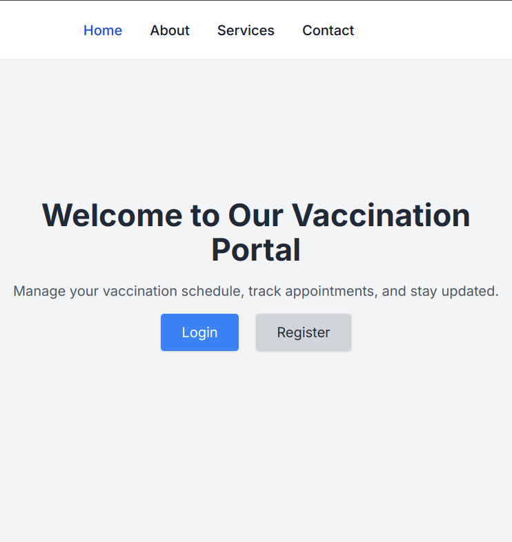
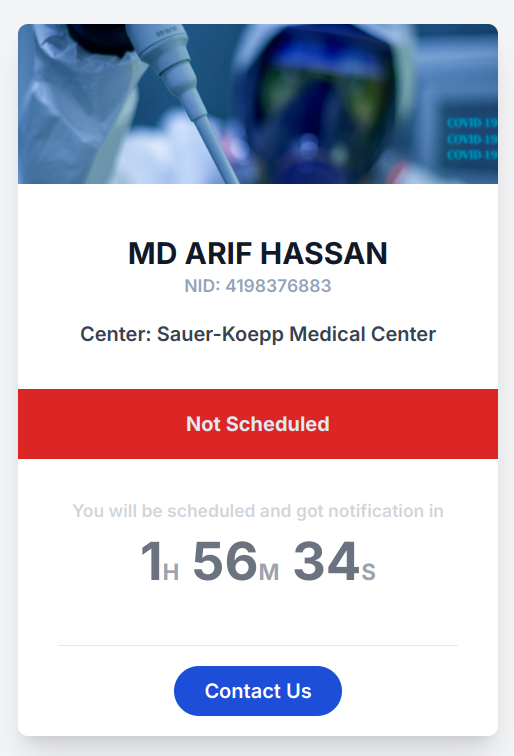
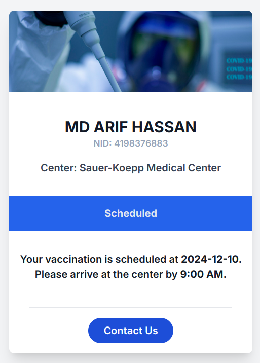
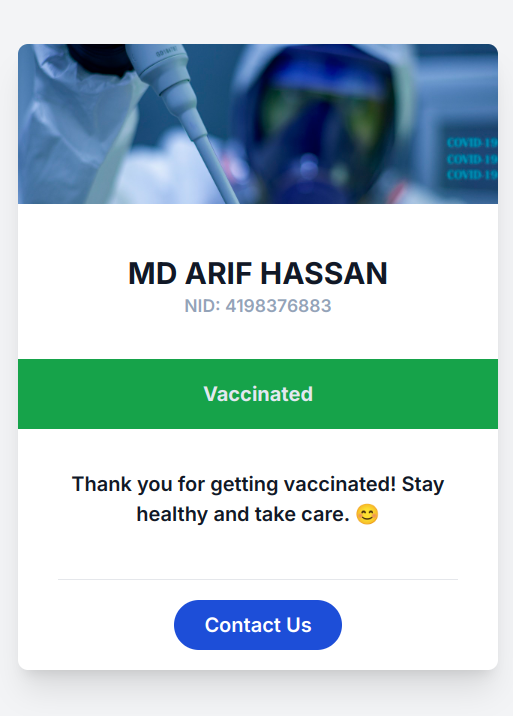

# VaccineFlow - Vaccine Scheduling System

This is a Laravel-based Vaccine Scheduling System that allows user registration, vaccination date scheduling, and vaccination status management. FilamentPHP is used for the Admin Panel.

---

<table>
  <tr>
    <td></td>
    <td></td>
    <td></td>
    <td></td>
  </tr>
</table>

## Features

-   **User Registration**: Accessible via `/registration` route.
-   **Scheduled Tasks**:

    -   **`ProcessVaccinationSchedule`**: Schedules vaccination dates for users.
    -   **`UpdateVaccinatedUser`**: Updates user vaccination status after the scheduled time.

-   **FilamentPHP Admin Panel**: Accessible via `/admin/login`.

---

## Setup Instructions

1.  ### Seed the Database:

    #### Use the following command to add sample users and vaccine centers:

    ```bash
    php artisan db:seed
    ```

1.  ### Start the development server:

    ```bash
    php artisan serve
    ```

1.  ### Start the npm server:

    ```bash
    npm run dev
    ```

1.  Start Queue Worker to process scheduled jobs:

    ```bash
    php artisan queue:work
    ```

1.  Access the Filament Admin Panel:

Visit **`/admin/login`** and log in with the registered email and password.
View the list of users, their vaccination status, and assigned vaccine centers.
Use the filter option to filter users by status or vaccine center.

### Technologies Used

-   Laravel
-   FilamentPHP
-   MySQL
-   Queue and Scheduler (Laravel Queues)
